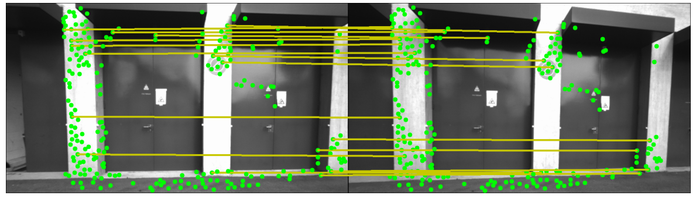
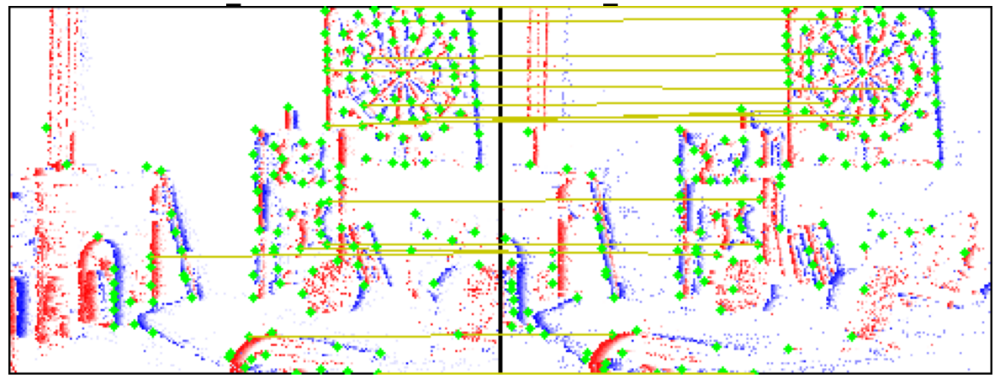
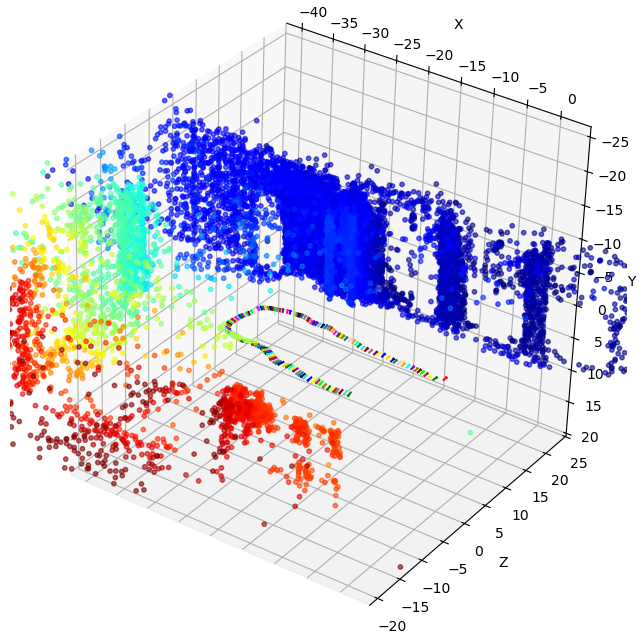
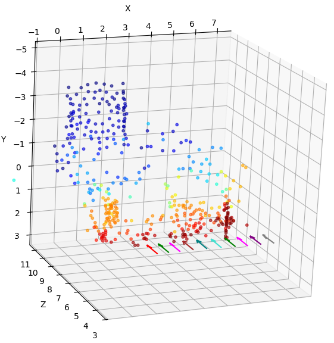

# Event-Based & Frame-Based Structure from Motion (SfM)

This repository contains a complete, incremental Structure from Motion (SfM) pipeline designed to process both standard frame-based inputs and asynchronous event-stream data (via MCTS). 

The defining feature of this project is the ground-up implementation of the entire incremental SfM architecture. By implementing the core solvers—rather than relying on high-level libraries—this pipeline serves as a transparent environment for experimenting with unconventional data types like event streams.

Key implementations include:
- **Mathematical Core:** Algebraic solvers, RANSAC, Non-linear PnP & Triangulation using custom Analytic Jacobians (Generic Levenberg-Marquardt optimization suite), Local Bundle Adjustment.
- **Multimodal Ingestion:** Natively validates geometry using ETH3D standard frame bounds before deploying on asynchronous event data from UZH via SuperEvent (MCTS).
- **Temporal Diagnostics:** Custom tooling to statistically evaluate the chronological feature lag and structural collapse induced by dynamic camera kinematics.
---

## 🚀 Quick Start

### 1. Prepare Environment
```bash
mamba env create -f environment.yml
mamba activate sfm_env
```

### 2. Configure and Run
Modify `config.py` to target your desired dataset (`slider_depth`, `urban`, `delivery_area`, etc.), and execute the pipeline:
```bash
python run_sfm.py
```

---

## 🖼️ Results

### 1. Feature Matching (Frame & Event)
Matched keypoints for both standard ETH3D images (using kornia's DISK) and SuperEvent-based Multi-Channel Time Surfaces (using SuperEvent).

| ETH3D (electro_rig) Matches | UZH (slider_depth) Matches |
|:---:|:---:|
|  |  |

---

### 2. 3D Reconstruction
Dense point cloud results generated from scratch using our custom analytical geometry solvers.

| ETH3D (electro_rig) Recon | UZH (slider_depth) Recon |
|:---:|:---:|
|  |  |
